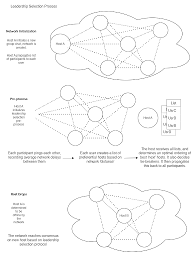
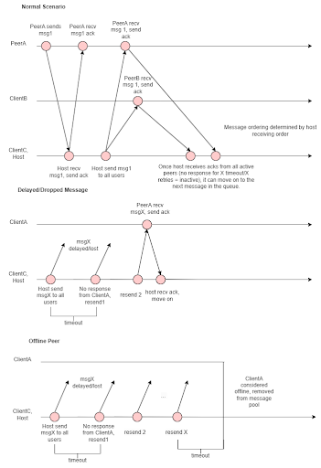

# Interface and Messaging Protocol

## Interface

A large portion of this project consists of formalizing the protocol and interface, while the implementation itself plays a smaller role. This section describes general steps in core functionality in the project. Creating the formal documentation is outside the scope of the proposal, and will follow in the project implementation.

**Network (Private Chat) Initialization:**
- There is some user who wants to start the chat, client C1
- C1 has a list of users’ client addresses
- C1 sends an init message to the users to invite them to the chat
    - C1 will send the invite in intervals for some timeout 
        - Exponential back off
    - Clients need to respond within this time to join the chat
- The chat session is initialized at this point. Invited users are considered participants, but are inactive until they respond to the invite.

**Status of host**
- Host sends periodic pings (heartbeat) to all clients 
- Heartbeat is a list of users
- All messages sent are stored on the client in a map/list
    - Only gets cleared after a heartbeat
    - If a host swap happens, all messages in map/list are resent to the new host

**Leadership Selection**

This section consists of the focus of our project. The aim is to implement a form of weighted ranked voting between clients on initialization to decide on next hosts, and a majority request system to determine when the current host is offline and to migrate to a new host. This process is likely to be altered if the stretch goal of host migration is implemented.

- Host Candidate List. After network is initialized:
    - Each client will send a few pings to every other client to determine its average network delay to other participants.
    - Each client passes it’s ordered list of hosts by delay to the current host
    - The host will receive a list from every client and find the optimal next host list based on these ‘votes’
    - The host uses this list as it’s heartbeat ping.
- Leadership Election
    - If a client doesn’t receive a heartbeat in X duration, it sends a election request to the next host on the list.
    - All clients are listening for these requests at all times. If a client receives a majority of votes in X minutes, it becomes the new host and broadcasts to all clients
    - Clients keep voting until a new host is decided and starts broadcasting the host heartbeat.
        - Vote for candidate1 for X duration. If candidate 1 doesn’t achieve majority within X duration, it broadcasts its inelgibility. Vote for candidate2 for X duration …
        - Fallback scenario if no majority is reached

***Optimal Candidate Hosts***

The ordered list of host candidates decided after network initialization is based on the centrality of a client within the network. This is defined as the client with the least average network delay to every other client in the network.

Once the current host receives average network delays between every pair of clients, it computes the candidate list by using the Floyd-Warshall algorithm and calculating centrality for each client, taking in consideration asymmetric network delays (different delays for clients A -> B and B-> A).

Algorithm Pseudocode
```
	Recieve network delay “edges” from all clients

	Build a directed graph using edge weights

	Compute shortest paths between vertices (clients) using Floyd-Warshall algorithm, obtaining matrix of shortest paths between all pairs.

    Compute closeness centrality score for each server

    Return ordering by centrality score
```

Closeness centrality of a client i is defined as:
```
	closeness(i) = 1 / (sum of average network delay from i to all other clients)
	centrality(i) = 1 / closeness(i)
```

**Leadership Selection Process**


		
**Basic Messaging**
- Client C2, sends a message to the host
- Host broadcasts the message to all the clients
    - We set a timeout and retry hyperparameter 
- The host keeps track of the messages that were not delivered to some clients
    - The clients likely disconnected

**Message Ordering Scenarios**



**User rejoins after being inactive**
- Client keep tracks of users, can send a message to any of the clients / hosts to find the address of the current host
    - If the current host has the history of the missed message for that client it will receive them
    - Otherwise, this client will be readded to the messaging service with no messaging history

**Get History**
- Client requests history with some n param 
- The Host keeps track of what slice of the history the client has received 
- On the next get history call it will send the next slice of size n
- This will be used for pagination from the client

**Assumptions and Constraints**
- Chat service is designed to be used by small private groups of trusted users
    - Initial host knows list of other users client addresses beforehand
    - Clients manually communicate private key beforehand for encryption
- Scaling constraints
    - We tradeoff decentralizing with the burden of workload by the leader. In its current proposed state, this service will not scale to large networks as all messages propagate through a single host server.
    - *Overhead for all peers acknowledging messages and detecting offlines. Retransmission/redundancy can be used for better performance over simplicity.
- CAP theorem (ish)
    - Under the context of an ongoing chat session:
        - Chat sessions are mostly available: Dropped/delayed messages are fault tolerant, but messages cannot be handled during leadership migration.
        - Chat sessions are partition tolerant: When a host is disconnected, the network can continue with leadership selection.
        - Chat sessions are not consistent: Chat ordering is determined by the current host, meaning that the true timing order of messages is not preserved.
- Limitations:
    - *Maximum network size* (number of users): Defined by the hosts computing resources and how many users it can support while maintaining “real-time” messaging functionality. This requires testing at scale to determine set limits.
    - *Message size*: While the HTTP specification has no specific limits, we will limit text messages (the only supported format) to 2048 characters.
    - *Message frequency*: We won’t impose any frequency limits within private chats, as the assumed use case is between trusted users. Other popular chat services typically do not have limits too, but rather anti-spam measures (stretch goal).

**Failure Scenarios**
- *Network Partition*
    - Non-host
        - If non-host users are disconnected, the network simply continues - disconnected users are presumed to be offline by the host when they don’t acknowledge messages after X retries / X duration, and do not receive any more messages.
        - Non-host users will need to reconnect by notifying the host, by pinging other users for its address. It’s empty state will need to be updated by the host (stretch goal).
    - Host disconnection
        - Clients will deem the host offline when no heartbeat is received within X duration.
            - The leadership selection process will proceed with the pre-determined list of candidates
    - Hybrid failure
        - If a network partition occurs where the host and a majority of users are disconnected from a minority of users, the minority of users are disconnected from the chat session until a connection can be re-established. The chat session continues with the majority.
        - If a network partition occurs where the host and a minority of users are disconnected from a majority of users, the majority will perform leadership selection within itself and elect a new host.
            - The original host keeps track of responding clients. If it goes below the majority of users, the host is in a potentially invalidated state. If it receives a heartbeat from now on, it knows that a majority has elected a new host and it is no longer the host. 
            - *This process will be formalized further in the protocol documentation